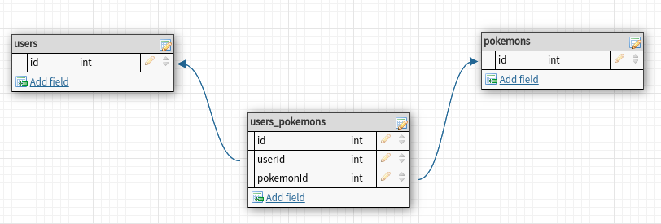

# Express Pokedex

Working with databases, especially through ORMs, can present quite a learning curve. We'll start by incorporating one database model into an application to save favorite Pokemon.

#### Backstory: Pokemon

If you're not familiar with Pokemon, Pokemon is a franchise/universe created by Satoshi Tajiri in 1995. It's a famous franchise in both the US and Japan. Fun facts:

* Pokemon is short for "Pocket Monsters"
* The Pokemon universe extends to games, trading cards, and TV
* [The Pokemon Company](https://en.wikipedia.org/wiki/The_Pok%C3%A9mon_Company) is headquartered in Bellevue, WA.

## Getting Started

We'll be using the [PokeAPI](http://pokeapi.co/), a Pokemon API that allows us to get a list of Pokemon.


## User Stories
* As a user (AAU) I want to create an account
* (AAU) I want to sign in
* (AAU) I want to log out
* (AAU) I want to browse all the available pokemon
* As a logged in user, I want to select my favorite Pokemon and add them to a list of favorites
* As a logged in user, once I add a Pokemon to my list of favorites, I want to be redirected to my favorites page.

## Entity Relationship Diagram



## Requirements
### Part 1: Project Setup & API Investigation
Run `npm i` to install dependencies

Setup `server.js` with a basic express server

Use `axios` to fetch pokemon data from the pokemon API at the home route `/`
* Display that data in `index.ejs`

### Part 2: Setup Database

Your first step will be to create a SQL database for your application. Recall the process:

1. Use `npm` to install the required modules for postgres and sequelize: `pg` and `sequelize`
2. Make sure your Postgres server is running (check for the elephant).
3. Run `sequelize init` to initialize Sequelize.
4. Update your newly created `config/config.json` file as we did in class. This means changing the credentials, updating the SQL flavor, and changing the database name to `pokedex`.
5. Run `createdb pokedex` to create your database inside of Postgres

### Part 3: Create your Pokemon Model and Table

Our data model needs only one attribute: `name`.

1. Use the `sequelize model:create` command to make the `pokemon` model. This creates both the model JS and the migration JS files.
2. Use the `sequelize db:migrate` command to apply the migrations.
3. Confirm that your `database` and `model` are inside Postgres using the `terminal`
4. Create a `dbTest.js` with the following code:

```js
// Make sure to require your models in the files where they will be used.
const db = require('./models');

db.pokemon.create({
    name: 'pikachu'
  }).then(poke => {
    console.log('Created: ', poke.name)
  })

db.pokemon.findOne({
  where: {
    name: 'pikachu'
  }
}).then(poke => {
  console.log('Found: ', poke.name)
})
```

Test by running the file: `node dbTest.js`.

### Part 4: Integrating the database with the app

You'll want to add functionality to the following routes by incorporating the `pokemon` table you created.

* `GET /pokemon`
  * View: `views/pokemon/index.ejs`
  * Purpose: Retrieve the user's favorited Pokemon and displays them on the page
  * What sequelize function will do this for us?
* `POST /pokemon`
  * The form for adding will be included on the main index page
  * View: none (redirect to `/pokemon`)
  * Purpose: Creates a new Pokemon and redirects back to `/pokemon`
  * What is the sequelize function we use here?

### Part 5: Display more info on each Pokemon

Add a route `GET /pokemon/:name` that renders a `show` page with information about the Pokemon.

* You can get detailed information about a Pokemon by passing the Pokemon's name to PokeAPI. You can retrieve images, abilities, stats, and moves through the API.
* Example: http://pokeapi.co/api/v2/pokemon/bulbasaur/

Check out the result of the pokemon API calls (or see the [doc page](http://pokeapi.co/)) for ideas on what data you could show. Show at least 4 pieces of data (e.g. attacks, habitat, etc.)

### Part 6: Add User Model:
Similar to how in step 3 we created a `pokemon` model, create a `user` model with fields `username` and `password`

Run the migrations and test the newly made model in your `dbTest.js`

### Part 6.5 Add the users_pokemons join table
* Create the join table using `sequelize model:create`
* Update the `user` model to have a Many to Many relationship with `pokemon`
```
static associate(models) {
    models.user.belongsToMany(models.pokemon, { through: 'users_pokemons'})
}
```
* Update the `pokemon` model to have a Many to Many relationship with `user`
```
static associate(models) {
    models.pokemon.belongsToMany(models.user, { through: 'users_pokemons'})
}
```

### Part 7: Update app w/ User Auth
Add conditional rendering to your Navbar. If there's a `user` logged in, render a Log Out button, and if there isn't, render Log in and Sign up buttons.

Views and Routes to create:

* GET /auth/login - Display a login form
* GET /auth/new - Display a signup form that posts to /auth
* POST /auth - Create a user 

### Part 8: Revisit Pokemon Controller w/ the User association
* Revisit the POST /pokemon route: When creating a pokemon, we must add the `user` relationship
`res.locals.user.addPokemon(newPokemon)`
* Revisit the GET /pokemon route: On the pokemon index page - show only the pokemon that belong to the logged in user!
* If there is no logged in user - redirect to the sign in page!


## API Limits
You might notice the API doesn't return all the data it has at once. It has a
default limit of 20. That means if it has a list of 150 (or more) Pokemon it
will only return 20 at a time, by default.

<http://pokeapi.co/api/v2/pokemon/>

The API has a way to get around this limit. You can pass a different limit in
the query string. The limit allows you to ask the API to return more than it's
default amount.

Remember, query strings are parameters passed in the URL after a question mark
and separated with ampersands. They look like this:

```
http://mapwebsite.com/?lat=40.284&long=110.133&zoom=12
```

This is a URL. It consists of four parts:
1. the *protocol* is `http://`
2. the *domain* is `mapwebsite.com`
3. the *path* is `/` (the root path)
4. the *query string* is `?lat=40.284&long=110.133`

The query string is like a JavaScript object. There's keys and values.
This query string has three keys and values:

| Key  | Value   |
| ---  | ---     |
| lat  | 40.284  |
| long | 110.133 |
| zoom | 12  |

The Pokemon API is configured to read all sorts of keys and values from
the query string. Perhaps the most useful one we'll use is `limit`. Specifying
smaller or larger limits tells the server to send back more or less data.

Specify a limit of just one to see the first item in the list:
`<http://pokeapi.co/api/v2/pokemon?limit=1>`

Or, specify a limit of 151 to see all 151 pokemon!
`<http://pokeapi.co/api/v2/pokemon?limit=151>`

## Bonuses

* Add the ability to DELETE Pokemon from the favorites list.  
* Rethink the `pokemon` table. Instead of it being a list of favorites, have it be a list of pokemon the user owns. What columns should the table have? `nickname`, `level`, etc... How would this change the app?
---

## Licensing
1. All content is licensed under a CC-BY-NC-SA 4.0 license.
2. All software code is licensed under GNU GPLv3. For commercial use or alternative licensing, please contact legal@ga.co.
